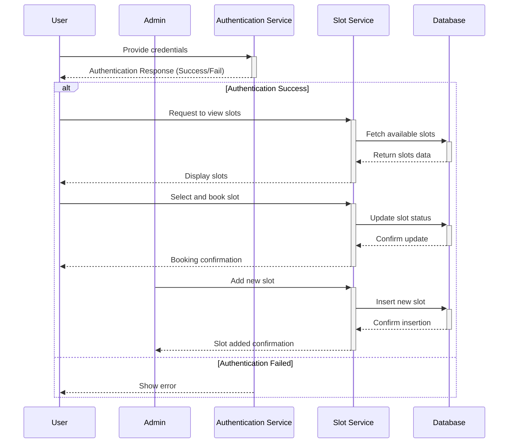

# EmptySlot
A web application for booking any service and making payments for it through the Stripe.

## Run

1. prepare `.env` file (see `example.env`)

### frontend
1. `cd frontend`
1. make sure if you make `npm ci`
2. with `npm start`

### backend 
1. `cd backend`
1. with `docker compose up`

